 

## Olá, eu sou o Renato

Desenvolvedor de software focado em transformar rotinas complicadas em produtos simples de usar. Trabalho entre **interfaces web**, **aplicações desktop**, **automação** e **ferramentas com IA**, sempre pensando no produto inteiro: arquitetura, experiência, privacidade, distribuição e manutenção.

Hoje, meu trabalho gira principalmente em torno de:

- aplicações confiáveis que respeitam os dados do usuário;
- sistemas de gestão construídos para operações reais;
- produtos web rápidos, responsivos e instaláveis;
- ferramentas locais que usam IA sem sacrificar privacidade;
- interfaces que tornam regras complexas fáceis de entender.

> Gosto de software que resolve um problema de verdade, funciona bem fora da demonstração e continua agradável depois do centésimo uso.

## O que estou construindo

<table>
  <tr>
    <td width="50%" valign="top">
      <h3 align="center">CashPad</h3>
      
<strong>Divisão de gastos sem atrito</strong>

      
PWA mobile-first para registrar despesas, dividir contas e calcular saldos entre amigos. Sincroniza pelo Firebase e compartilha o resumo no WhatsApp.

      
<code>JavaScript</code> <code>Firebase</code> <code>PWA</code> <code>Vercel</code>

      
<a href="https://cashpadapp.vercel.app"><strong>Abrir app</strong></a> · <a href="https://github.com/renato0x/CashPad"><strong>Ver código</strong></a>

    </td>
    <td width="50%" valign="top">
      <h3 align="center">Transcripty</h3>
      
<strong>Transcrição privada no Windows</strong>

      
Aplicativo desktop que converte voz em texto localmente com Whisper. Tem atalho global, push-to-talk, detecção de voz e cola o resultado direto no cursor.

      
<code>Python</code> <code>PySide6</code> <code>Whisper</code> <code>PyInstaller</code>

      
<a href="https://github.com/renato0x/Transcripty/releases"><strong>Baixar</strong></a> · <a href="https://github.com/renato0x/Transcripty"><strong>Ver código</strong></a>

    </td>
  </tr>
  <tr>
    <td width="50%" valign="top">
      <h3 align="center">Gection</h3>
      
<strong>Finanças pessoais em ação</strong>

      
Sistema desktop nativo e privado para contas, transações, faturas, orçamentos, assinaturas e planejamento financeiro. Os dados permanecem na máquina.

      
<code>React</code> <code>TypeScript</code> <code>Tauri</code> <code>Rust</code> <code>SQLite</code>

      
<a href="https://github.com/renato0x/Gection"><strong>Conhecer projeto</strong></a>

    </td>
    <td width="50%" valign="top">
      <h3 align="center">AltoLab OS</h3>
      
<strong>Gestão feita sob medida</strong>

      
Plataforma operacional para assistência técnica, com ordens de serviço em Kanban, clientes, agenda, financeiro, relatórios e integração com WhatsApp.

      
<code>Next.js</code> <code>TypeScript</code> <code>Supabase</code> <code>PostgreSQL</code>

      
<a href="https://github.com/renato0x/OSLab-Showcase"><strong>Ver showcase</strong></a>

    </td>
  </tr>
</table>

  <a href="https://github.com/renato0x?tab=repositories"><strong>Explorar todos os repositórios →</strong></a>

## Tecnologias e ferramentas

**Uso no dia a dia**

 

  

**Dados, plataforma e qualidade**

 

 

| Área | Ferramentas e práticas |
|:--|:--|
| **Frontend** | React, Next.js, TypeScript, JavaScript, Tailwind CSS, design responsivo e PWA |
| **Desktop** | Tauri, Rust, PySide6, C#, aplicações locais e empacotamento para Windows |
| **Dados & backend** | PostgreSQL, Supabase, Firebase Firestore, SQLite, autenticação e APIs |
| **IA & automação** | Whisper local, processamento de áudio, scripts Python e automação de fluxos |
| **Qualidade** | Git, Playwright, ESLint, segurança por padrão, acessibilidade e UX |

## Atividade no GitHub

 

## Vamos conversar

Quer trocar uma ideia sobre produto, software desktop, automação ou alguma colaboração? O melhor ponto de partida é o próprio GitHub.

  

Construindo software útil, uma iteração de cada vez.

